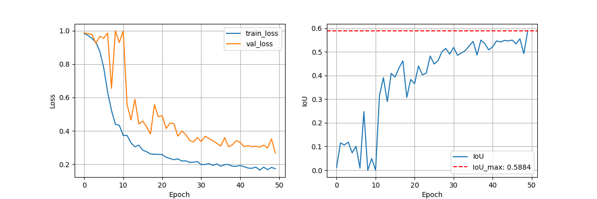

Dental X-Ray Image Classification using CNN (UNet++ with EfficientNet-B0)

This project focuses on semantic segmentation of dental X-ray images to detect dental caries (tooth decay). It uses a UNet++ architecture with an EfficientNet-B0 encoder, trained on grayscale X-ray images and corresponding annotated masks.

 Project Overview
Task: Pixel-wise segmentation of caries in dental X-ray images.

Architecture: UNet++ with EfficientNet-B0 encoder via segmentation_models_pytorch.

Loss Function: Dice Loss

Metrics: IoU, Dice Score, Accuracy, Precision, Sensitivity, Specificity

Frameworks: PyTorch, torchvision, segmentation-models-pytorch

Input: Grayscale dental X-ray images

Output: Binary mask highlighting caries regions

Training
The training pipeline includes:

Data loading with augmentation

Dice loss for handling class imbalance

Evaluation using multiple segmentation metrics

Visualization of predictions

# Install requirements
pip install numpy matplotlib opencv-python pillow torch torchvision segmentation-models-pytorch scikit-learn tqdm
Run the training script:

python train.py
train.py contains model setup, data loading, training loop, evaluation, and plotting.

Training Results
Model trained for 50 epochs

Best IoU achieved: ~0.XX (replace with your actual value)

Visualizations saved in efficientnet-b0.png:

  

Inference Example
The model's predictions look like:

Input Image	Ground Truth	Predicted Mask	Overlay

Replace these images with actual examples from your output folder.

Evaluation Metrics
The model reports the following for validation data:

IoU (Jaccard Index)

Dice Coefficient

Accuracy

Precision

Sensitivity

Specificity

All metrics are logged and saved to log.txt.

Model Architecture

model = smp.UnetPlusPlus(
    encoder_name='efficientnet-b0',
    encoder_weights='imagenet',
    in_channels=1,   # grayscale X-ray
    classes=1        # binary segmentation
)

# Load model
model = torch.load('UNetEfficientnetB0-best.pth', weights_only=False).eval()

# Predict
image, label = eval_dataset[6]
with torch.no_grad():
    output = model(image.unsqueeze(0))
    prediction = torch.sigmoid(output).squeeze(0)
Then visualize using matplotlib.

Dependencies
Python >= 3.8

torch >= 1.12

segmentation_models_pytorch

numpy, opencv-python, Pillow, matplotlib, tqdm, scikit-learn

Author
Name: Nilesh Maurya

Use Case
This project can be used as a starting point for:

Medical image segmentation research

Dental X-ray analysis tools

Building custom models using UNet++ in PyTorch
